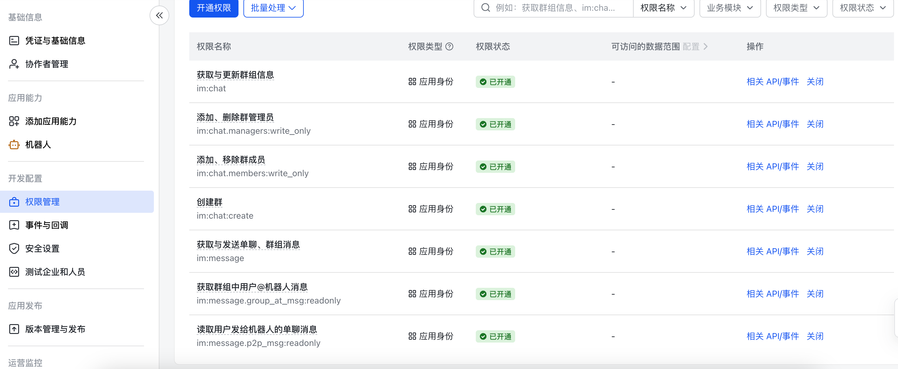
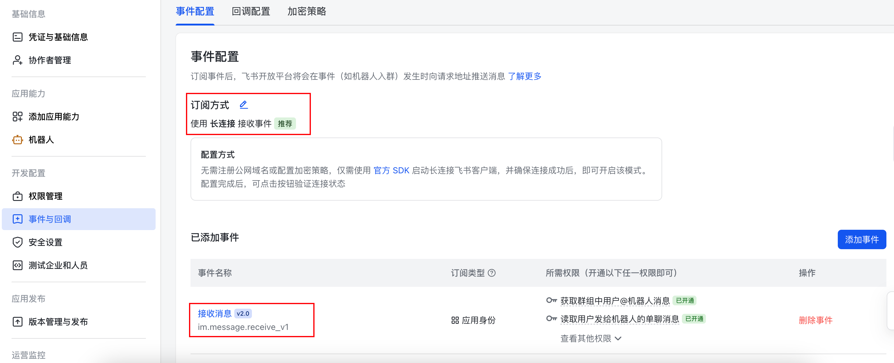
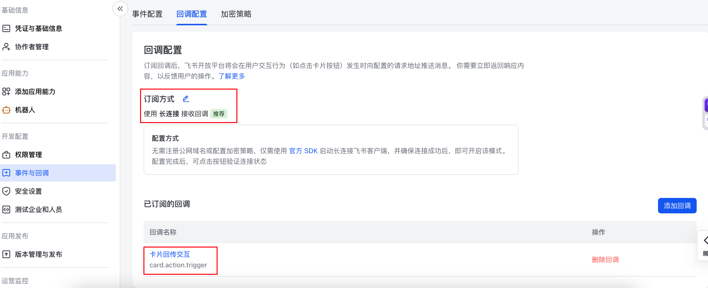

# 飞书自建应用配置指引

> **先看这里**：飞书自建应用的创建、启用机器人、申请权限、事件订阅、发布版本，**全部只能在 [open.feishu.cn](https://open.feishu.cn) 网页控制台手动操作**，没有 CLI / API 能一键完成（开放 API 只能发消息、建群等业务操作，不能管理应用本身）。所以这一步**必须你自己在网页上点**，本项目的安装脚本帮不了。按下面走一遍，约 10–15 分钟，一次配好之后不用再动。
>
> 前提：本机能联网（长连接是 relay 主动出站连飞书，**不需要公网 IP / 入站端口**，但要能访问 open.feishu.cn）。

---

## 1. 创建自建应用

1. 打开 https://open.feishu.cn ，登录（需飞书企业管理员，或管理员给你开发者权限）。
2. 「开发者后台」→「企业自建应用」→「创建企业自建应用」。
3. 填应用名称（如 `CC 远程桥`）、描述、图标，创建。

## 2. 启用机器人能力

1. 应用 → 左侧「应用能力」→「机器人」。
2. 点「启用机器人」。**不启用，单聊连输入框都没有**。

## 3. 申请权限

左侧「权限管理」，按中文关键词搜索勾选（控制台展示的就是中文名；scope 标识符仅供参考，以控制台实际名称为准）：

| 用途 | 权限中文名（搜索关键词） | scope（参考） |
|---|---|---|
| 机器人发消息给你 / 群 | 获取与发送单聊、群组消息 | `im:message` |
| 单聊收你的 `/list /open` 指令 | 读取用户发给机器人的单聊消息 | `im:message.p2p_msg:readonly` |
| 会话群里收你发的文本 | 获取群组中所有消息 | `im:message.group_at_msg:readonly` |
| 建会话群、读群信息 | 获取与更新群组信息 | `im:chat` |
| `/open` 自动建群 | 创建群 | `im:chat:create` |
| 群成员/管理员管理 | 添加、删除群管理员 | `im:chat.managers:write_only` |



> 飞书偶有调整权限名，搜不到精确名时按"消息""群"分类展开，勾用途相符的即可。勾完点「批量开通」。

## 4. 事件订阅 + 回调配置（都选长连接，不要选 HTTP 回调）

### 4a. 事件订阅 — 加「接收消息」

1. 左侧「事件订阅」（或「事件与回调」→「事件订阅」）。
2. **请求方式选「使用长连接接收事件」**（关键！选「将事件发送至开发者服务器」会要求公网回调 URL，本项目靠长连接免公网 IP）。
3. 添加事件：`接收消息` / `im.message.receive_v1` —— 收你发的消息（**必须订阅**，否则单聊收不到输入）。建议订阅 **v2.0** 版本，别同时订 v1.0+v2.0 否则重复收。



### 4b. 回调配置 — 加「卡片交互回传」

1. 左侧「回调配置」（或「事件与回调」→「回调配置」/「卡片回调」）。
2. 同样选**长连接**方式。
3. 添加 `卡片交互回传` / `card.action.trigger` —— 收方案审批卡片的按钮点击（手机点按钮确认方案用）。**这是方案卡片按钮能点的关键**，没配的话点按钮没反应。



**坑（飞书官方提示）**：
- 事件/回调添加后必须**发布应用版本**（第 5 步）才生效。
- 飞书"至少发送一次"，可能重复推同一条消息；本项目按 `header.event_id` 去重已处理。
- 长连接要求 3 秒内处理完事件，否则会重试（本项目即时返回不阻塞）。

## 5. 发布版本 + 管理员审核

1. 左侧「版本管理与发布」→「创建版本」。
2. 填版本号、更新说明，提交发布。
3. 企业管理员在「应用发布」审核通过后，配置才生效。
4. **坑**：以后每次改权限 / 机器人能力 / 事件，都要**重新发版本 + 审核**才上线。

## 6. 可用范围

左侧「可用范围」→ 选「全部成员」（个人用也建议全部成员，省事），或仅自己。

## 7. 拿凭证填 .env

1. 左侧「凭证与基础信息」→ 复制 **App ID**（`cli_...`）和 **App Secret**。
2. 填入项目 `.env`：
   ```
   FEISHU_APP_ID=cli_你的AppID
   FEISHU_APP_SECRET=你的AppSecret
   ```

## 8. 拿自己的 open_id（白名单安全保障）

**为什么要这个 id**：`FEISHU_MY_OPEN_ID` 是白名单——relay 收到消息时，只处理「发送者 open_id == 这个值」的消息，别人的消息直接丢弃（`commands.js` 里 `openId !== myOpenId` 就 return）。作用是**让机器人只回复你个人飞书账号发的消息**，防止企业里别人（或任何能联系到这个机器人的人）通过它操控你的电脑。留空 = 不校验，任何人都能控，**不建议长期留空**。换机器人后 open_id 会变（飞书 open_id 按应用分），新机器人要重拿。

1. 先按 [SETUP.md](../SETUP.md) 把 relay 起起来（这步 `FEISHU_MY_OPEN_ID` 留空 = 临时不校验）。
2. 飞书里找到机器人（单聊），发任意一条消息（比如 `hi`）。
3. 从 relay 日志提取 open_id（稳定过滤命令，抓全部历史 + 去重）：
   ```bash
   tmux capture-pane -t relay -p -S - | grep -oE 'from=ou_[a-zA-Z0-9]+' | sort -u
   ```
   输出形如 `from=ou_09de...`，`ou_...` 那串就是你的 open_id。多个时取**最近**那条 recv 的（`| tail -1`）。
4. 填回 `.env`：
   ```
   FEISHU_MY_OPEN_ID=ou_你的openId
   ```
5. 重启 relay 让白名单生效：`pkill -f 'relay\.js'`（看门狗自动拉起）。

**其他查 open_id 的办法**（都不如发消息看日志直接）：
- 飞书开放 API `contact.user.batch.get_id`：用手机号/邮箱换 open_id，需应用开通通讯录权限 + 先拿 app_access_token，比发条消息麻烦。
- 飞书开发者后台「开发者工具」偶有按手机号查 open_id 的入口（以实际后台为准，不保证有）。
- 发消息看日志仍是最快——一次 `hi` 就有。

## 9. 验收

飞书单聊机器人发 `/list`：
- 回你运行中的 CC 会话列表 → ✅ 全通。
- 回 `(无会话)` → 消息通路通了，只是电脑上还没起 claude 会话，按 SETUP 第 9 步起一个再 `/open`。
- 完全无反应 / 显示已读不回 → `bin/doctor` 查 relay 是否在跑、`.env` 凭证是否对、事件订阅是否选了长连接 + 发布审核通过。

---

配好后回 [SETUP.md](../SETUP.md) / [README](../README.md)。
